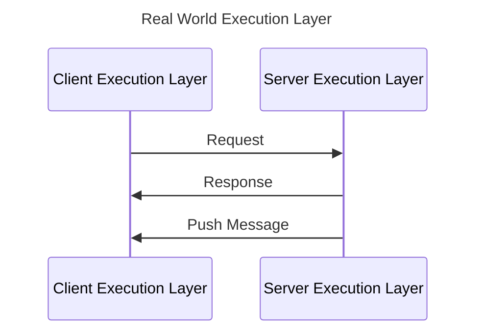
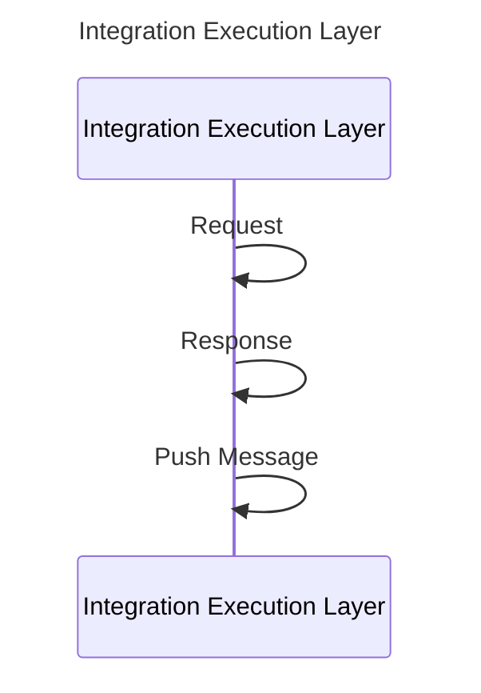

# Websocket Integration Tests

## Purpose

Show that we can integration test our websocket applications without spinning up http server.
This will speed up our tests.

For example, our current account api, public api websocket integration tests spin up a http server.
Introduces race conditions, lose control of messaging, debugging is unreliable, 
  intermittency, slow, use of waiters.
Maybe worse, for euclid, we don't have integration and every test is run in acceptance, 
and acceptance needs K8S to be up.  
I think we did this was, because spinning up an http server is quick and easy, almost a 1 liner.

##  Quick Start

Step through this test to see the workings.
`dnt.websockets.integration.IntegrationTest` is the goal of this repository, a quick IT that tests 
the implementation, without the websocket infrastructure.

### Compare against these test
Same interfaces, just wired up for the real world.
- `dnt.websockets.integration.vertx.IntegrationWebSocketTest` (uses websockets)
- `dnt.websockets.integration.maybecool.IntegrationTcpTest` (maybe cool, uses old school TCP/IP)
- `dnt.websockets.integration.also.IntegrationEventBusTest` (also, uses event bus model)

Repo Link
https://github.com/lmax-north/websocket-integration-test

It may not be the nicest example, but it shows that it is possible.

## Demo

- Test Comparisons
    - Integration with Vertx
    - Integration
    - Thread Counts

- Verify no messages
    - Test durations

    
- Implementation

- Finish
  - Rest
  - Maybe cool
  - Also
  - Feedback `/give`

